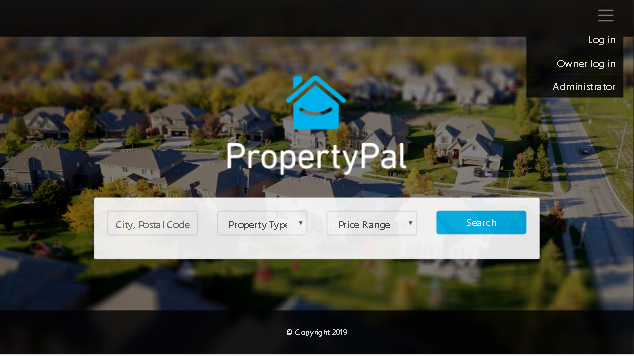
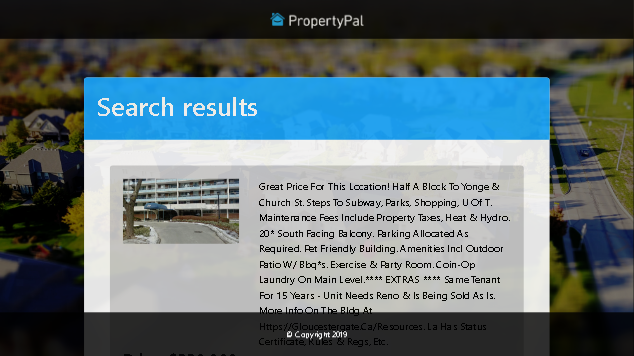
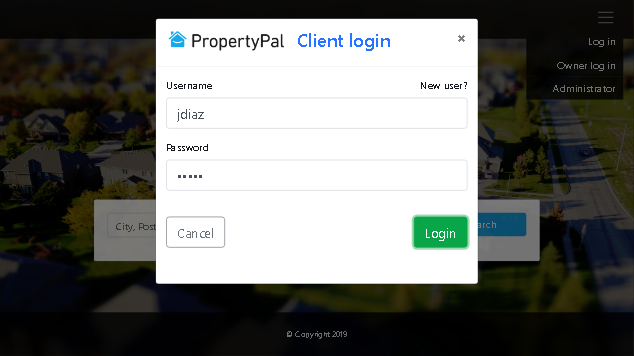
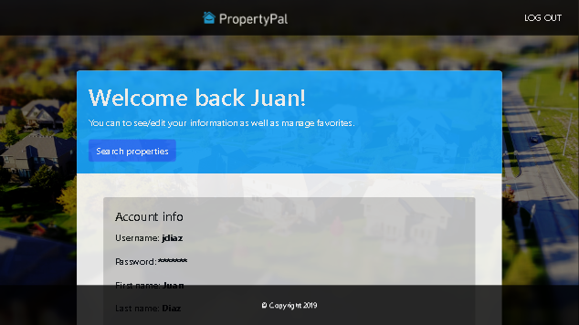
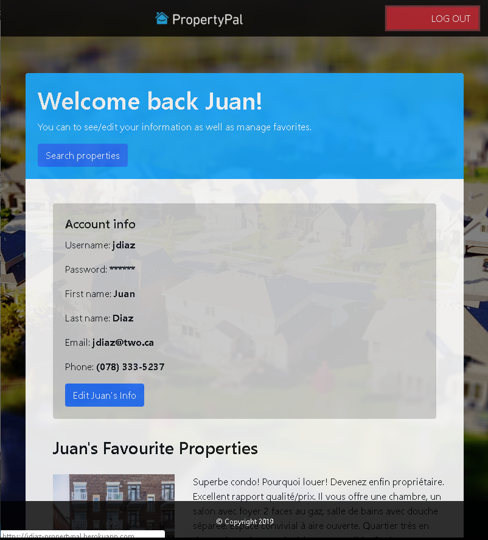
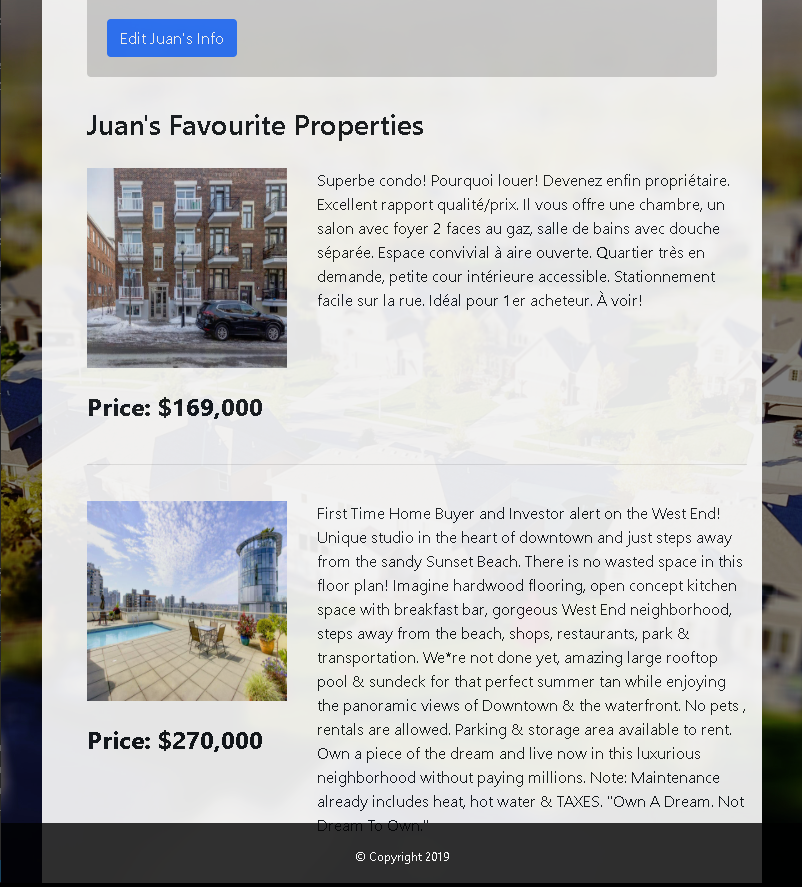
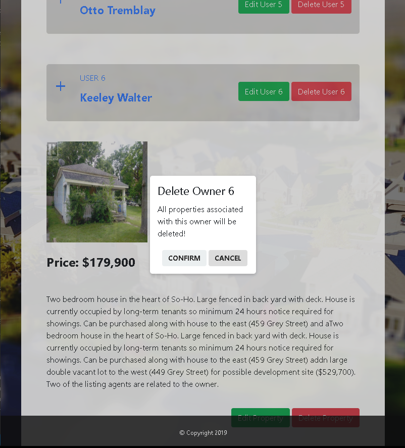
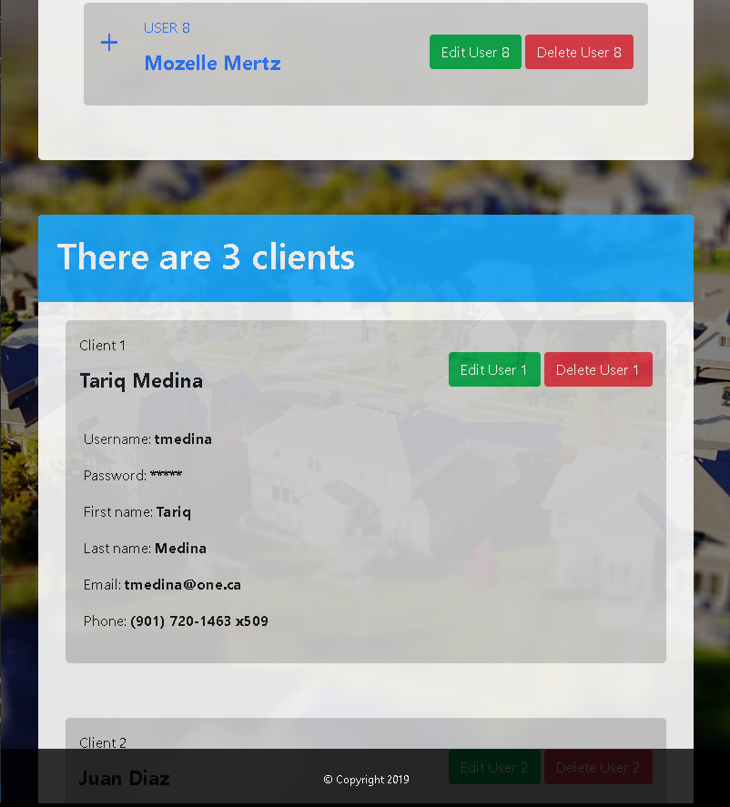
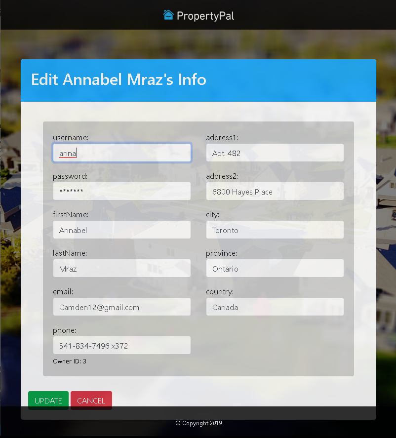
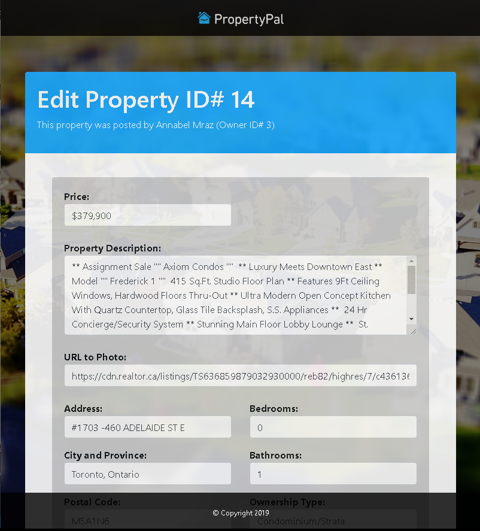

# PropertyPal
## Real Estate solution for direct selling Owner-Client ##

See the project [live](https://idiaz-propertypal.herokuapp.com)!

> **Cretaed by**
- Tony Green (https://github.com/AnthonyVerde)
- Tariq Medina (https://github.com/TariqMedina)
- Juan I Diaz (jdi@idiaz.ca)

> **Date:** March 2019

> ## Project Description

This project is a fully functional and fully mobile responsive site deployed in [Heroku](https://idiaz-propertypal.herokuapp.com). The idea behind this site is to provide owners to post their properties in a place where potential buyers can look for them without the need of a third party (realtor).

The project is based on **node.js** and **express.js**. The back end is backed by a **MySQL Database** and **Sequelize** as the ORM. The aplication has been deployed in **Heroku** using their **JewsDB** database application.

> ## Building tools
- **FRONT END**
    - HTML, CSS
    - Javascript and jQuery
    - Bootstrap

- **BACK END**
    - node.js
    - Express
    - ORM
    - MySQL / JawsDB MySQL
    - Handlebars

- **Deployment**
    - Heroku

>**Screenshots**

*Landing page - Mobile*

*Landing page - Mobile*

*Client login modal - Mobile*

*Client page - Mobile*

*Client page - Web*

*Client page - Web*

*Site administrator's page - Web*

*Site administrator's page - Web*

*Owner edit page - Web*

*Property edit page - Web*

